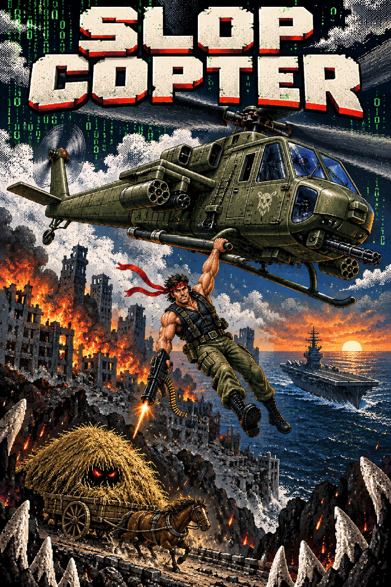

# Slop Copter

<p align="center">
  
</p>

A browser adaptation of the StuntCopter prototype from `hyprsplitter`. Starts as
the original monochrome stunt game. Every missed carriage changes one piece of
the game into a dark, green digital simulation. Once the whole world has changed, the next missed
stuntman gets up and starts shooting back.

Story and progression possibilities are saved in [the ideas notebook](docs/IDEAS.md).

[Play Slop Copter](https://slop-copter.pages.dev/) · [GitHub](https://github.com/gardnmi/slop-copter)

## Run

Requires Node.js 22.12 or newer. The game itself runs entirely in the browser;
it does not require Python, GTK, or Wayland.

```sh
npm ci
npm run dev
```

Open the localhost URL printed by Vite (normally <http://127.0.0.1:5173>).

```sh
npm run build
npm run preview
```

Deploy the contents of `dist/` to any static web host. The build uses relative
asset paths so it also works in a subdirectory. No backend or external asset
requests are required. Vite preview is for checking the production build locally.

Production uses **Cloudflare Pages**, matching Omacontra's static Direct Upload
setup. `npm run deploy` builds and publishes the site. See [deployment instructions](docs/deployment.md).

## Jump to a level for testing

After completing the game and returning to the hay cart, **Levels** unlocks in
the toolbar. The unlock is saved in this browser. Click the button to open it;
there is no keyboard shortcut, and L remains the deck grenade control. Choose a
chapter, fight or cutscene and click **Start selected level**. The selector pauses
the current run; closing it resumes the previous state. Each selection starts a
fresh test run with the correct equipment and normal chapter checkpoints. Saved
high scores stay untouched; **R / New game** returns to a normal run.

The address updates to a bookmarkable `?level=...` URL. Reloading starts that
selection again. This also works in the production build. Examples:

- `http://127.0.0.1:5173/?level=chrome-carriage` — chrome horse boss.
- `http://127.0.0.1:5173/?level=rooftops` — rooftop run.
- `http://127.0.0.1:5173/?level=rescue` — helicopter pickup.
- `http://127.0.0.1:5173/?level=airship` — Iron Vulture flying boss.
- `http://127.0.0.1:5173/?level=carrier` — friendly carrier arrival.
- `http://127.0.0.1:5173/?level=landing` — playable carrier landing with limited fuel.
- `http://127.0.0.1:5173/?level=deck-raid` — carrier deck run-and-gun.
- `http://127.0.0.1:5173/?level=deck-cargo` — lower cargo bay and upper route.
- `http://127.0.0.1:5173/?level=deck-catwalks` — hangar climb and elevator shaft.
- `http://127.0.0.1:5173/?level=spaceship` — moving spacecraft boss.

The menu also includes classic flight, the Matrix uprising, bandana cutscene,
Terminator fight, liquid-metal takeover, self-destruct escape, burning city,
freeway, shipyards and carrier approach. Entrances are defined in
`src/level-select.js`; arrow keys and Space keep their normal actions.

## Play

The game fills the browser viewport, with no desktop window frame or surrounding
page. Press **F** or click **Fullscreen** to use browser fullscreen; press F again
or the browser's Esc shortcut to exit. Rotation, window resizing, and fullscreen
changes preserve the run. The playfield expands with the screen; sprites retain
their proportions and the dashboard stays along the bottom.

| Action | Control |
| --- | --- |
| Fly | Hold arrow keys / WASD to accelerate; release to slow to a hover |
| Alternate steering | Touch directions or drag the instrument yoke |
| Drop | Space, click the sky or helicopter, or the touch Drop button |
| Liquid hunter | Arrow keys dodge homing rockets; Space drops grenades; five hits defeat it |
| Cloudfall | Left/Right, A/D, left stick or D-pad move; J or Space jumps on rock, release and press again to fire the handheld gun in the air; land or stomp to reload |
| Pause / resume | P, Esc, or the toolbar; Space also resumes |
| Retry after defeat | Automatically restarts the current checkpoint after 1.2 seconds |
| Start over | R or New game |
| Options and instructions | ? or Options |
| Fullscreen | F or Fullscreen |

**Controllers work through the whole campaign**, including Cloudfall. Connect a
standard Xbox, PlayStation or compatible gamepad and press a button to activate it.
Left stick / D-pad moves; A / Cross starts, drops and jumps. Hold A / Cross or
RT / R2 for lift when landing on the carrier. On deck, X / Square or RT / R2
fires and B / Circle throws grenades. In Cloudfall, A / Cross, X / Square or
RT / R2 jumps from a ledge and fires in the air; release after jumping before
firing. Menu / Start pauses or resumes. View / Share opens Options; directions
navigate menus, left / right adjusts sliders, A confirms and B goes back.
Disconnecting an active controller pauses and releases its inputs. Reconnecting
requires releasing held buttons before resuming. Keyboard and touch remain usable.

Browsers may require an initial click or keyboard press to enable audio. Controller
input uses the browser's [standard Gamepad mapping](https://developer.mozilla.org/en-US/docs/Web/API/Gamepad_API/Using_the_Gamepad_API).

Directional controls request velocity through the same acceleration as the
instrument yoke. Releasing the keys brakes gradually; pressing the opposite
direction brakes before accelerating back the other way. Mouse movement and
dragging in the playfield do not steer. Clicking drops the stuntman while you
continue flying with the keys.

Open **Options → Acceleration** to set the time a held direction takes to
reach full horizontal speed, from 0.20 to 1.50 seconds (default 0.50). A shorter
time gives quicker response; a longer time makes buildup gentler. The setting
persists across new games and reloads when browser storage is available. Standard
keyboard input is digital; speed comes from hold duration rather than pressure.

Touch screens have directional and drop buttons. You can hold a direction with
one finger and drop with another. Arrow keys work throughout the active game,
including after using the toolbar. Leaving the browser
window or hiding the tab pauses everything and clears held movement.

Land in the hay behind the driver. The wagon wraps right to left. Clouds slow
descent and move the stuntman sideways only within the original cloud silhouette.
Once transformed, a cloud also sets a passing stuntman on fire. His first landing
in unburned hay still scores, but ignites the load. The fire follows the cart,
including its driver-pulled and motorized forms. Later landings in burning hay
are fatal misses; they advance transformation and eventually create Terminators
like other misses. The liquid-metal takeover smothers the fire, and a new game
resets it.
Successful drops score **release height × level**. Five perfect jumps advance
the level; a failed round repeats without undoing the transformation. Later
levels increase wagon speed, then slow the falling stuntman.

Before retaliation, two consecutive safe landings make the carriage sabotage
the next drop. It brakes or bolts away from the falling stuntman, rechecking
his position if clouds move him. The third attempt misses, and the streak resets.
This continues through the digital transformation, then stops when the first
attacker gets up. Five perfect landings can then advance the level normally.

After the sixth miss completes the Matrix transformation, stuntmen start jumping
automatically. Keep steering: each resolved landing is followed by a short reload,
and the jumps continue until eight Terminators have been created. Safe catches do
not count toward the eight. Then dropping stops for the existing three-second
pause before the bandana cutscene. Pause, crashes, and later chapters stop auto-drop.

Chapter checkpoints are saved for the current run at the Matrix uprising, the
armed counterattack, and the chrome-carriage fight. After defeat, the game waits
1.2 seconds, then automatically restores the start
of that chapter, its entry score and carriage state, with full hull and a brief
damage grace period. Earlier chapters stay complete. Rooftops retain their own
retry; R / New game deliberately clears checkpoints and starts from the beginning.
Best scores and the acceleration setting survive either choice.
The self-destruct escape gets its own checkpoint after the horse is defeated.

Defeating the elevator Warden sends the machine crashing into the lift. The floor
breaks beneath the commando, and the continuous fall gradually becomes
[Cloudfall](docs/cloudfall.md).

Landing on the horse kills it and stops the cart. Its original fallen-horse
sprite remains on the ground while the driver hops out, then pulls the cart
at a slower pace. The driver can still brake or sprint during a sabotaged drop.
The horse stays dead until a new game; the old horse position no longer counts
as a horse collision. Pause and fullscreen resizing preserve the takeover.

The driver keeps his original hat and profile when he dismounts, with distinct
step-off, hop, and reaching poses. He lands beyond the fallen horse and grips
the cart shaft. His connected torso and legs use an eight-frame walking stride
paced by the distance he pulls, with planted feet and no pose reset when stopped. Landing
on him kills him too. The buggy stops for a short ignition sequence with three
smoke bursts, then accelerates into a self-driving cart. An exposed engine
rumbles above the wheels and exhaust drifts from its rear pipe. Hitting the
driver while he is still seated lets the surviving horse run free. The cart
remains a landing target and keeps its third-drop trick until retaliation.

The transformation happens **after** each missed jump's splat animation:

| Miss | Change |
| --- | --- |
| 1 | Cloud |
| 2 | Carriage |
| 3 | Helicopter |
| 4 | Stuntman |
| 5 | Instruments |
| 6 | World and game controls become a dark, green digital simulation |
| 7 onward | That missed stuntman gets up and joins the attack |

Once the world transforms, **SLOP COPTER** assembles from falling green code
in the middle of the sky. Dim letters and brighter cascading trails sit behind
the game sprites. Reduced-motion mode displays the lettering without the rain
animation and suppresses the engine's body shake.

Successful jumps never advance the transformation or create an attacker.
The first six missed men do not reappear later. Each attacker aims at the
helicopter's position when firing; keep moving to dodge. Three hits cause smoke,
a spinning crash, an explosion, and game over. Reset returns everything to
Classic. Your best score persists in browser storage when available.

The ground attackers are tiny chrome endoskeletons with red eyes, exposed ribs,
thin mechanical limbs, and compact rifles. Their standing bodies remain 32
logical pixels tall, matching the original 16-pixel stuntman frames at 2× scale.
Deliberate blocks of metal shading, broad rib shapes, distinct red eye sockets,
jointed limbs, and gunmetal rifles give them a 16-bit look at the same size.
They recover through prone and kneeling poses, turn toward the helicopter, and
aim with recoil. Shots originate at the visible barrel.

The eighth Terminator begins a three-second countdown while gameplay continues.
Further drops stop: the man on the helicopter is staying aboard. A 4.6-second
interlude then freezes the world in a narrow, horizontal pixel-art panel:
an eye close-up, tying a red bandana, racking a machine gun, and opening fire.
Its framing draws on the dramatic close-ups and cuts in the
[NES Ninja Gaiden cinematics](https://www.destructoid.com/the-memory-card-45-the-birth-of-the-cutscene/).
The illustrated cinematic panels and shaded character atlas use the user's
Omacontra artwork as the style reference, generated with the built-in image tool.
Separate transparent body, weapon, and three cloth frames keep the gun attached
and both red bandana tails moving. The body stays 32 logical pixels tall on a
short harness. Exact prompts and references are in `public/assets/counterattack-prompts.json`.

Back in gameplay, the same small stuntman is now a Rambo-style gunner, firing
automatically diagonally downward. Fly left or right to turn him; change altitude
and position to sweep the firing line across the machines. Each takes two rounds,
falls into scrap, and awards 250 points. The HUD counts remaining targets; all
eight down turns the Matrix sky title into **VICTORY** and stops his gunfire.
Incoming shots still damage the helicopter, with one second of protection when
the cinematic returns control. Pause freezes both the countdown and cutscene;
resizing preserves progress. Reduced motion holds the cloth and camera steady
and removes rapid muzzle flashes while retaining the story and projectile play.

After all eight machines are destroyed, the falling-code **SLOP COPTER** title
reforms into **VICTORY**, with a bright sweep and a short victory tune. This
3.6-second celebration plays behind the helicopter, carriage, and wrecks while
you keep flying. The letters then dissolve back into the game title as the
eight wrecks collapse into reflective liquid-metal pools, flow across
the floor, and engulf the horse carriage. A surviving driver runs away. Existing
horse and driver deaths stay intact; the transformation also works with a
horse-less or motorized cart. Flight continues throughout this sequence; pause
freezes both the world and animation. Both sky titles fit their actual letter
bounds with padding, including on narrow and very wide screens. Reduced motion
shows a steady victory title instead of the animated sweep.

A chrome horse and buggy, the **LIQUID HUNTER**, emerges from the metal. The
original silhouette remains: two spoked wheels, an armored version of the hay
mound, drawbars, and a skeletal mechanical horse with hooves and a red eye.
Four trot frames keep its wheels grounded as it travels left to right and wraps
to the other side, following the old carriage's route. A launcher on the buggy
flashes a **LOCK** warning before
firing a homing rocket. Rockets initially leave the launcher, then turn toward
the helicopter with a limited turn rate. They run out of fuel, coast, and expire;
keep moving and change direction to make them overshoot. Three hits still cause
the usual helicopter crash.

Rambo puts away the machine gun and holds grenades. **Arrow keys fly; Space drops
a grenade straight down**, with a 1.1-second reload and unlimited grenades. There
is no aiming control and no automatic gunfire during this fight. Lead the moving
horse and buggy and land **five separate grenade hits**. Each hit fills one HUD
marker; a miss or a rocket explosion does not count. The fifth hit dissolves the carriage,
clears its rockets, and awards 3,000 points. Pause, resizing and fullscreen preserve
the fight; a new game clears it.

The chrome horse-and-buggy atlas uses the original wagon for its shape and
Omacontra's mechanical artwork for its arcade shading. Its four trot frames and
exact generation prompt live in `public/assets/chrome-carriage-atlas.png` and
`public/assets/chrome-carriage-prompts.json`. The mercury pool and grenade-hand
poses still come from `public/assets/liquid-hunter-atlas.png`; its former beast
frames are unused. Shared anchors keep the wheels and launcher steady, and
grenade and helicopter collisions follow the shorter carriage silhouette.
Reduced motion holds the trot pose and
removes flickering warnings while retaining the visible rocket paths and grenade
physics. Optional synthesized victory, melting and reveal cues can be disabled
in **Options → Audio**.

Defeating the chrome horse and buggy arms a **12-second self-destruct**. The Matrix
title becomes a right arrow with a large two-digit countdown, both formed from
the same animated code glyphs behind the action. Hold right: actual forward travel
gradually reveals a lighter gray city and rooftops. The bomb explodes behind you;
the spreading blast tears off the helicopter's tail, and the stuntman leaps onto
a visible ledge, tucks and rolls. He gets up carrying his machine gun and runs
from the expanding explosion. Press **Space / ↑ / touch** to jump; hold for longer
leaps. Crates cost speed, windows shatter, and later rooftops introduce cranes,
and collapsing buildings. After a fall, Space or touch retries
the rooftops; R restarts the full game. Best running distance is saved separately.

Survive **20 seconds** on foot and the camera pulls back as an armored rescue
helicopter comes in low. Keep running until its boarding rail lights up, then
**jump with Space / ↑ / touch** to grab it. You have five seconds to board; the
helicopter lifts you away from the explosion with no scene cut. A missed pickup
gets its own checkpoint, retaining your distance and earlier score.
The detailed helicopter and reach/hang/pull-up poses use new original pixel art.

The rescue now continues into an **overhead helicopter assault**: city, freeway,
shipyards and open water lead to an aircraft carrier carrying a spacecraft.
**Arrows fly and the cannon fires automatically.** Defeat automatically retries the current section.
Tanks, radar-guided missile trucks, gunboats, drones and enemy helicopters defend
a shorter 62-second route with fighter formations, active ground crossfire and P
cannon upgrades. Bright labeled supply badges bob and shine above smoke: gold
POWER, blue WINGMAN and green REPAIR. Each district has a checkpoint. Defeat the giant enemy
**Iron Vulture airship**, then watch a short Top Gun-style alignment scene before
catching the **moving friendly carrier** in a playable landing challenge. **Up / W / Space powers lift; Left / Right tilts.** Manage limited fuel,
match the carrier's speed and settle level on the lit aft pad. Fuel, drift and
descent instruments guide the approach. A crash automatically retries the landing
with full fuel and skips the approach cinematic;
a safe touchdown leads onto the deck. [Air assault design and controls](docs/carrier-assault.md).

Landing begins a **Metal Slug-inspired deck run-and-gun**. Our dark-haired,
red-bandana commando uses restyled reference animation alongside native Rebel
sprites. Arrows/WASD move, **J shoots, K jumps and L throws a
grenade**. Down ducks and Up aims upward. Touch uses red/yellow/green action
buttons; a standard gamepad uses X/Square, A/Cross and B/Circle respectively.
Fight infantry,
cross a broken service deck, descend into the cargo bay and climb hangar
catwalks over an open elevator shaft. Set off barrel chains and collect weapon
upgrades at three authored points along the route. Down + K drops through a catwalk.
**The spacecraft is the final boss:** it lifts off, crosses overhead and changes
sides above a two-tier arena. Use Up + J to attack overhead, leave marked mortar
impacts, climb above deck sweeps and move off the cannon's aiming line. Disable its
defenses, then ride the aircraft elevator down into the shaft and fight the Warden’s centered overhead command rig. The escape ship ends in wreckage. Each deck section and each boss phase have Continue
checkpoints. Start with a pistol, collect an early machine gun, a midpoint flamethrower, and a final machine gun before the bosses. Empty ammo returns to the pistol. Flame kills engulf infantry; machine-gun fire uses animated spread tracers. The HUD uses arcade score/ammo glyphs and a gold elapsed-time display.

The original **R-Shobu helicopter miniboss** attacks after the first broken-deck crossing, roughly a quarter of the way through the level, before the cargo bay and flamethrower. It drops bomb columns and has its own checkpoint. Open it from Levels or `?level=deck-helicopter`. The spacecraft now uses a matching pixel-art hull with articulated hover nozzles, retracting weapons and textured exhaust. Test the flight with Levels → Spacecraft boss (`?level=spaceship`), or jump to **Elevator / The Warden** (`?level=elevator`).

After the Warden fight, **Shaft collapse → Cloudfall** continues the campaign.
The defeated machine tears free of its hoists, crashes into the lift and breaks
it into falling sections. The camera follows the commando through the debris,
then reframes into the narrow well over 4.4 seconds. The ship textures and Rambo
sprite gradually become the red/white/black Downwell style. The character retains
his position and downward speed when controls return; no rocket or jump prompt
interrupts the fall.
**Left/Right or A/D move; J or Space jumps on rock and fires the handheld gun in the air.**
Release the action key after jumping before firing. J or Space also retries a failed descent. Landing or stomping white enemies
reloads; red spiked enemies must be shot. Ghosts pursue in two axes, ledge
hoppers jump at you, and wall crawlers telegraph a lunge. Seeded terrain chunks
combine branching routes, drillable gem pockets and enemies. Staying airborne
builds a chain; landing banks gems, extra charge and health at successive
thresholds. Collecting gems also triggers a temporary **Gem High** with stronger,
faster gunfire. Three descent bands have their own
checkpoints. This chapter supports keyboard and standard gamepads.
The descent now follows the original Downwell recording: a narrow black shaft,
white rock, red/white side scenery, animated reference sprites and impact clouds,
an outlined life bar and a tall charge gauge. Connected cave shelves, breakable
bridges and enclosed gem pockets replace the scattered box layout. The player
wears a red headband and holds a downward-firing gun; bullets and muzzle flashes
come from its barrel. There is no globe or Matrix cloud hazard in this chapter.
The reference artwork used for this private prototype is attributed in
[the asset provenance](public/assets/downwell/README.md).

The descent has **15 rooms**, followed by **Slop Eater**: a living heap of hay
from the opening cart. A narrow cinematic reveals eyes poking through straw,
then the boss's name and **THE HAY BITES BACK**. Shoot the exposed white eyes
with the **45-round machine gun**; covered eyes deflect rounds. The 60-health,
two-stage fight keeps its moving shaft, stomp reloads and warned rock-crushing
attacks. Layered straw bundles, dithered shadows, heavy brows and a broken twine
tie define the fuller hay silhouette. Loose fans rustle, its pupils track you,
and successful hits flash white. The supplied **机械终焉** level theme loops from the
start of the descent through the boss's final collapse, then fades out for the classic ending. Its
full stereo recording is compressed from 4.57 MB to 1.97 MB.
Six varied cave fragments, crumbling shelves and changing enemies keep the arena
moving. At half health **HAY TORN OPEN** announces torn straw and bleeding eyes.
The final defeat collapses the heap into flying chaff, blood and a chain of
red-and-white explosions. Automatic retry restores the machine gun, and the removed
spread-shot attack stays removed. You can keep firing during the collapse,
then the shaft washes white and opens into
**Full circle**: a high fall with a downward camera pan, a whiteout, Rambo
turning back into the original stuntman, a slow wobbling passage through a cloud,
and a landing in the moving hay cart. The original falling speeds apply outside
and inside the cloud. The Mac startup chord plays again on the final hay landing,
completing the loop.
The normal hay animation hands control back to classic Stunt Copter without
resetting the scene. That landing is the first catch of the new loop; records
and flight preferences survive.

Open **Levels → The descent** for `?level=shaft-collapse`, `?level=downwell`,
`?level=downwell-storm`, `?level=downwell-core`, `?level=slop-eater`,
`?level=slop-eater-fight`, or `?level=full-circle`.
[Reference study, mechanics and testing](docs/cloudfall.md).

[Deck mission and reference code](docs/deck-raid.md) ·
[Third-party sprite credits](public/assets/reference/README.md).

The gray pixel city, parallax, speed buildup and jump rhythm draw on Canabalt's
official source port. The small armed run cycle uses Contra's running poses as
a reference. [Research, controls and implementation](docs/rooftop-runner.md).

After its transformation, the cloud occasionally gives off a bright, compact
lightning flicker just below its silhouette. Arcs extend only 24–42 logical
pixels and last about 240 ms, with 7–13 seconds between flashes. This is purely
decorative. Pause freezes it, resizing keeps it small and attached to the cloud,
and reduced-motion mode further dims it. Its separate random stream leaves
the original cloud drift and falling physics unchanged.

Transformation recolors the sprites themselves. Dark fills follow their actual
silhouettes, with a one-source-pixel outline for contrast on the white sky.
Clouds use the original QuickDraw shape masks. There are no rectangular sprite
backdrops, corner brackets, or rectangular particle fields around assets.
After the helicopter transforms, it banks with horizontal acceleration and
braking and pitches with climbing and descending. The hanging stuntman follows
the helicopter's attachment point and drops from that position. The classic
helicopter stays level. Rotor frames are cropped into separate canvases before
scaling so the sprite-sheet border cannot appear beside the helicopter.

## Flight model and original reference

The original speed limits and boundaries were checked against Duane Blehm's
[StuntCopter 1.5 Pascal source](https://github.com/gamache/blehm/blob/32f10d0d8a3d6309aca7be40f9aa29c755f4dd10/Duane%20Blehm%27s%20Code/StuntCopter%20%C6%92/StuntCopter.pas),
especially `OneTimeGameStuff` and `AnimateOneLoop`.

- This adaptation uses arrow keys / WASD instead of the original's continuous
  mouse-position steering. Holding a direction requests velocity within the
  original limits: −4…+4 source pixels per animation step horizontally and
  −3…+4 vertically. Releasing requests zero velocity.
- By default the keyboard adaptation builds from rest to full horizontal speed
  over **0.5 seconds**. Releasing coasts to rest over **0.4 seconds**; a full
  reversal takes **1 second**, braking through zero before accelerating the
  other way. The acceleration slider changes buildup and reversal time while
  preserving top speed and release braking.
  This intentionally replaces the original one-unit-per-loop acceleration,
  which reached full speed in only 80 ms at the browser's simulation rate.
- The ceiling is −4 source pixels. At the bottom limit, the helicopter sprite
  remains 10 source pixels above the carriage. Horizontal wrapping follows the
  original helicopter rectangle and its edge offsets.
- All speeds use the original source-pixel steps at 2× logical artwork scale.
  Keyboard, touch directions, and the draggable dashboard yoke all use the same
  acceleration rules.

Regression tests cover acceleration duration, reversal, neutral braking, themed
pitch, real browser keyboard input, and mouse movement leaving flight commands
unchanged.

The original does **not** specify a fixed frame rate: it executes as quickly as
the Macintosh can run its event loop, with optional one-/two-tick delays in
version 1.5. Accordingly, a claim of exact original real-time pacing would be
misleading. The browser now uses **50 simulation steps per second**, independently
of display refresh, instead of the desktop prototype's 60. This approximates the
supplied [StuntCopter 1.2 reference recording](https://www.youtube.com/watch?v=aPAKfqRYWoI):
tracking the WALK carriage in one-second samples around 8–14 seconds gives about
51 source pixels/second (roughly 766 video pixels over six seconds, at 2.5 video
pixels per source pixel). This is a measured reference pace, not cycle-accurate
Macintosh emulation. The preserved desktop prototype keeps its historical rules.

## Migration

The source was found as an **untracked directory** at
`hyprsplitter/experiments/stunt-copter` on `main` (`647138b`). No local or
remote-tracking branch named `experiments/stunt-copter` was present.
The source repository was left untouched.

- `legacy/desktop/` preserves all 29 source, test, documentation, and asset files
  byte-for-byte, excluding generated Python caches.
- `legacy/SNAPSHOT.json` records their SHA-256 hashes and source state.
- `public/assets/` contains the six original sprite sheets. The digital theme
  uses code-drawn effects and the game's own title.
- The Python implementation remains a historical reference; the browser game
  ports its rules and graphics directly to JavaScript and Canvas 2D.
- The old prototype changed the entire theme and began combat on the **first**
  miss. The browser game replaces that with the staged sequence above.
- Desktop overlay surfaces and desktop focus/dragging integration are replaced
  by a single fullscreen-capable browser canvas. Original bitmap art, cloud masks,
  scoring, round rules, and combat are retained; the current flight audit and
  pacing changes are described above.

## Code

| File | Responsibility |
| --- | --- |
| `src/game.js` | Flight, original game rules, rounds, and transformation state |
| `src/carriage.js` | Evasion, horse/driver deaths, takeover, engine startup, exhaust, and collisions |
| `src/driver.js` | Original driver head, pixel walking poses, hand/shaft connection, and fall |
| `src/sky-title.js` | Fitted code-rain titles, pixel glyphs, victory morph and sweep |
| `src/lightning.js` | Transformed-cloud charging, random lightning paths, and strike timing |
| `src/combat.js` | Recovering stuntmen, aimed projectiles, swept collisions, damage, crash |
| `src/crew.js` | Pixel crew sprites, recovery poses, articulated weapons, and muzzle geometry |
| `src/counterattack.js` | Eight-enemy trigger, cinematic timing, automatic gunfire, and clearing the wave |
| `src/action-art.js` | Cinematic close-ups, bandana animation, small gunner, tracers, and fallen machines |
| `src/action-assets.js` | Bitmap atlas crops, body anchors, cloth knots, and cinematic muzzle position |
| `src/liquid-boss.js` | False victory, melt/flow/takeover, ground patrol, homing rockets and five-hit grenade fight |
| `src/liquid-art.js` | Liquid metal, chrome coating, trotting horse and buggy, grenades and rockets |
| `src/liquid-assets.js` | Creature run crops, muzzle positions, puddle and grenade-hand anchors |
| `src/boss-audio.js` | Gesture-unlocked victory, melting and creature cues, pause and mute |
| `src/runner.js` | Pursuit, helicopter destruction, landing roll and deterministic rooftop running |
| `src/runner-art.js` | Gradual gray city reveal, scrolling roofs, expanding blast and armed runner |
| `src/runner-assets.js` | Eight run frames and jump/fall/roll/crouch crops and anchors |
| `src/rescue-art.js` | Detailed rescue helicopter, animated rotors and hand-anchored boarding poses |
| `src/air-assault.js` | Overhead assault, dense waves, friendly arrival and section checkpoints |
| `src/air-art.js` | Aircraft/enemies, scrolling districts, ocean and airship fight |
| `src/airship.js` | Giant flying boss, destructible wing weapons and exposed reactor |
| `src/city-art.js` | Ruined-city map and anchored fire/smoke animation |
| `src/deck-raid.js` | Carrier run-and-gun, infantry, weapons, jumps and checkpoints |
| `src/deck-art.js` | Carrier panorama, small commandos, combat effects and spacecraft |
| `src/carrier-landing.js`, `src/landing-art.js` | Moving-carrier landing challenge, fuel, momentum and recovery instruments |
| `src/fire-art.js` | Pixel flames, burning hay, smoke and embers |
| `src/render.js` | Original sprite sheets, gradual asset themes, instruments, effects |
| `src/cloud-spans.js` | Original QuickDraw cloud collision masks |
| `src/layout.js` | Viewport sizing and dashboard/yoke coordinates |
| `src/main.js` | Browser lifecycle, keyboard/pointer/touch input, saved score, UI |
| `src/classic-audio.js`, `src/classic-sounds.js` | Mac startup chord and original StuntCopter rotor, landing and splat synthesis |
| `src/matrix-audio.js`, `src/matrix-sounds.js` | Electronic transformation cues and streamed Matrix chapter music |
| `src/escape-audio.js`, `src/escape-sounds.js`, `src/music-track.js` | Self-destruct alarms, explosion rumble and streamed rooftop escape music |
| `src/air-audio.js`, `src/air-sounds.js` | Raiden combat samples, bounded event playback and quiet helicopter rotor |
| `src/deck-audio.js` | Recorded Metal Slug effects and voices, plus streamed Arcade March chapter music |
| `src/orbit-audio.js` | Recorded descent combat effects, pickup accents and hay-boss audio |
| `src/hay-eater-art.js`, `src/hay-eater-sprite.js` | Original three-ink hay boss, layered straw, expressive eyes, damage poses and collapse |
| `src/style.css` | Fullscreen game, overlays, and responsive controls |

No runtime framework dependencies. Visual effects use simulation time and do
not consume physics randomness. Reduced-motion preferences suppress decorative
trails, muzzle flashes, hit flashes, and transformation rings.

The opening plays a classic Mac startup chord once; browsers that block autoplay
play it on the first click or keypress. The first flight chapter has the original
StuntCopter rotor, landing fanfare and splat, reconstructed from its source code.
Electronic cues accompany each transformation; **Cybernetic Pursuit** starts
when the background turns green. **Metallic Tension** takes over at self-destruct
and plays through the full rooftop run, helicopter rescue and overhead assault.
The supplied **Top Gun (NES) Main Theme** takes over for carrier arrival and
lunar landing, using a 1:52 loop cut from 0:08–2:00 and compressed to 808 KB.
A metallic countdown alarm with changing, rising pitches
leads to a distant detonation and a pursuing blast rumble.
The full stereo tracks are compressed from 5.41 MB to 2.33 MB and 5.06 MB to
2.15 MB respectively. The overhead assault uses short Raiden cannon, explosion
and pickup samples with a quiet helicopter bed. Recovery adds throttle, fuel,
touchdown and splash effects. **Arcade March** takes over on the deck and loops
through its helicopter miniboss, spacecraft and elevator boss; its full stereo
track is compressed from 3.81 MB to 1.57 MB. The deck uses recorded Metal Slug gunfire,
pickup voices, melee, enemy/player deaths and boss explosions. The descent adds
Downwell reference gunfire, stomps and damage recordings, Clonewell reload/impact
effects, original pickup accents and hay-boss cues; ten Opus samples total 28.5 KB.
[Descent audio sources](public/assets/audio/downwell/PROVENANCE.md). **Options → Audio**
has independent **Music** and **Sound effects** sliders (0–100%) plus a master
audio toggle. All three settings persist across reloads and chapters; the Mac
chord, voices, rotor and other gameplay sounds use the effects slider. Changes
adjust the live mix without restarting tracks. [Audio sources and behavior](docs/classic-audio.md).

## Verify

```sh
npm test
npx playwright install chromium
npm run test:browser
```

To use an existing Chromium installation instead of downloading a browser:

```sh
CHROMIUM_PATH=/usr/bin/chromium npm run test:browser
```

The browser suite builds production assets, checks desktop and phone controls,
walks through every transformation and combat, tests pause/reset and persistence,
checks real fullscreen entry/exit, resize, transparent asset corners, and the
production build. Screenshots and failure traces go to ignored
`test-results/`. A test-only `window.__stunt` interface is available on the dev
server with `?test`; it is removed from production builds.

The preserved desktop tests can be run separately if the old Python/Cairo/GTK
dependencies are installed:

```sh
python -m unittest discover -s legacy/desktop -p 'test_*.py'
```

## Credits

Original StuntCopter and bitmap art: **Duane Blehm / HomeTown Software,
1986–1987**. See
[asset provenance](public/assets/PROVENANCE.md) and the preserved
[reference study](legacy/desktop/REFERENCE.md) for source archives and attribution.
The original artwork is not newly authored or relicensed by this port.
